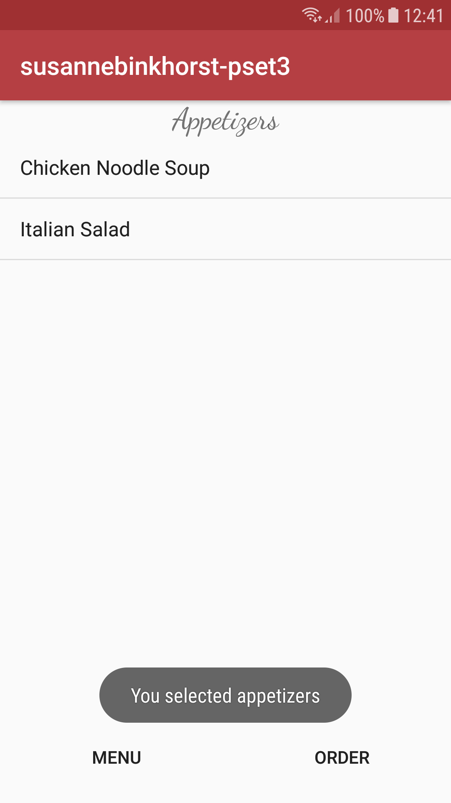
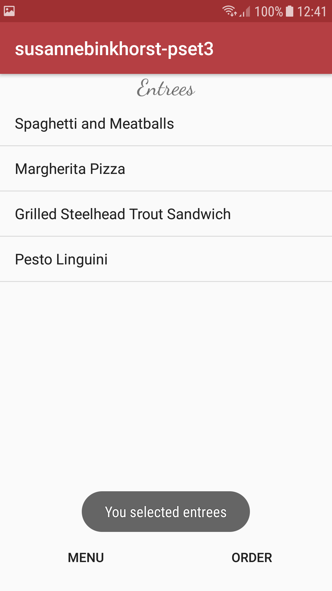
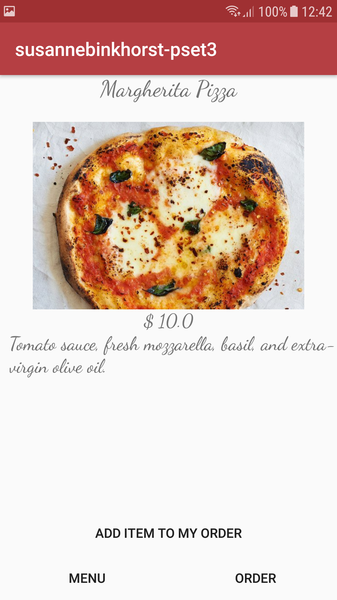
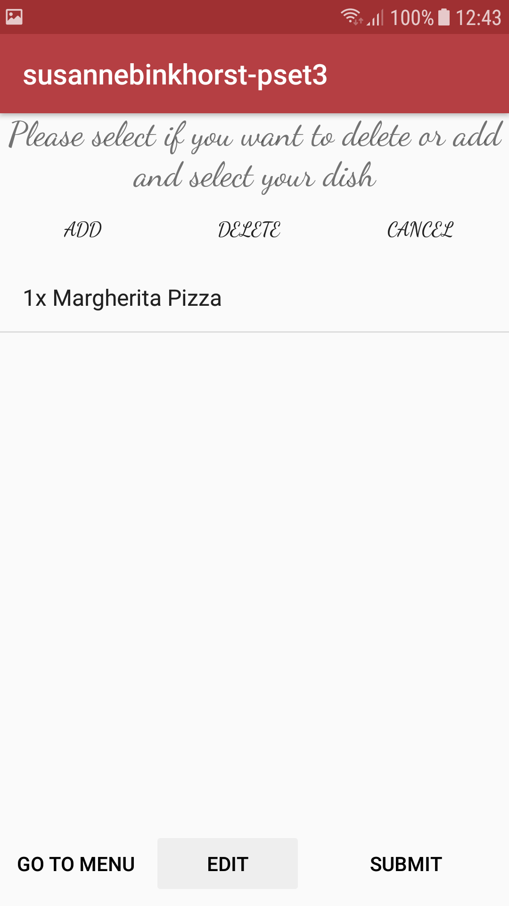
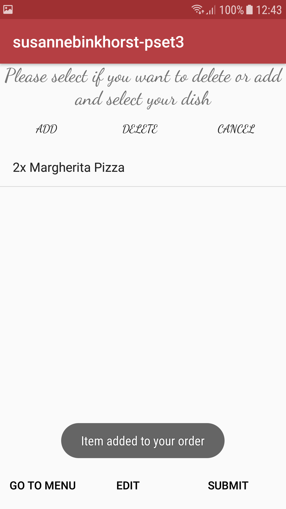
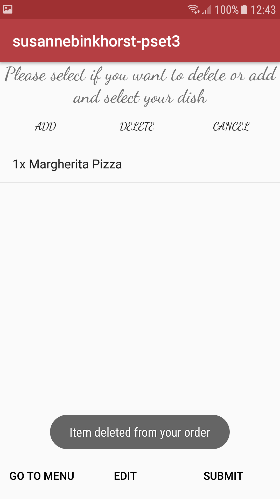
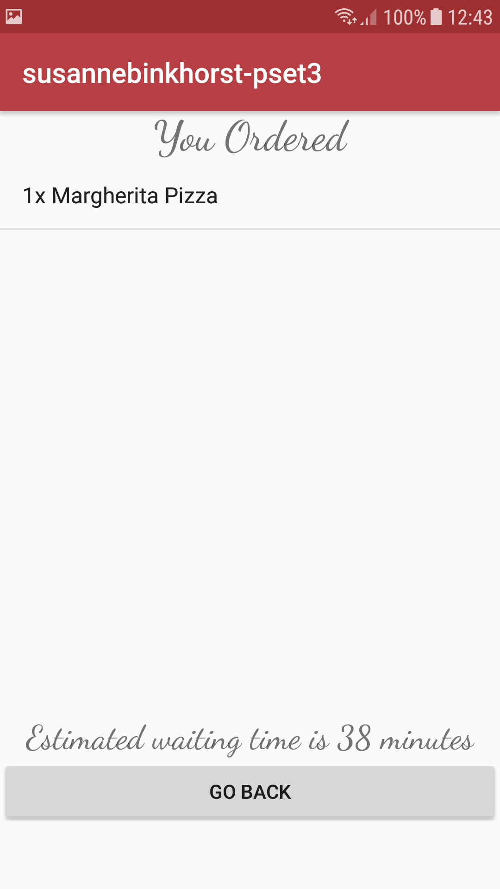

### susannebinkhorstpset3

This app lets you order items from a restaurant. The menu has two categories: entrees and appetizers.
You can edit your order, add items to order and submit order and get an estimated waiting time for your order.

